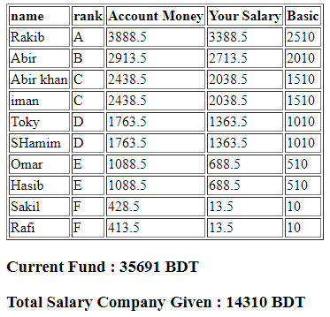

# Generate and distribute salary among employees based on their grade and basic. 
- If company fund is end then you can add some fund and re-generate salary of the employees

# Usage
> Input Company Fund and Lowest Basic of grade. 

> Generate auto output based on their basic.

